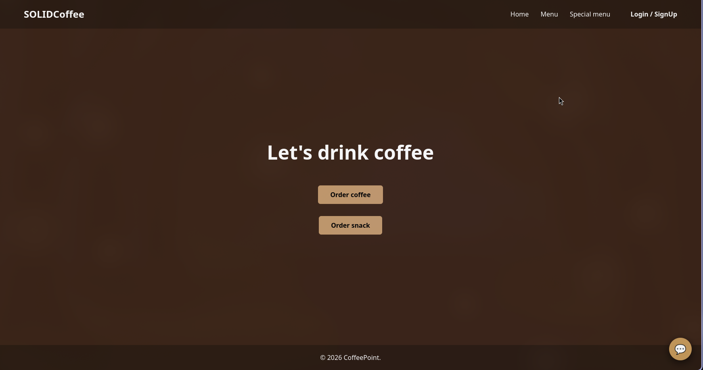
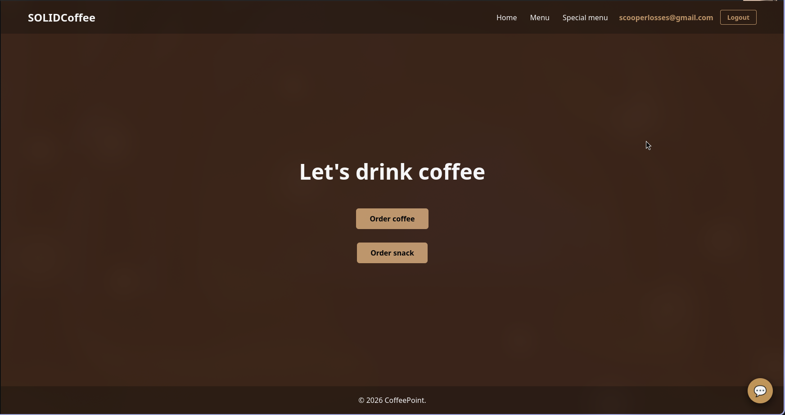
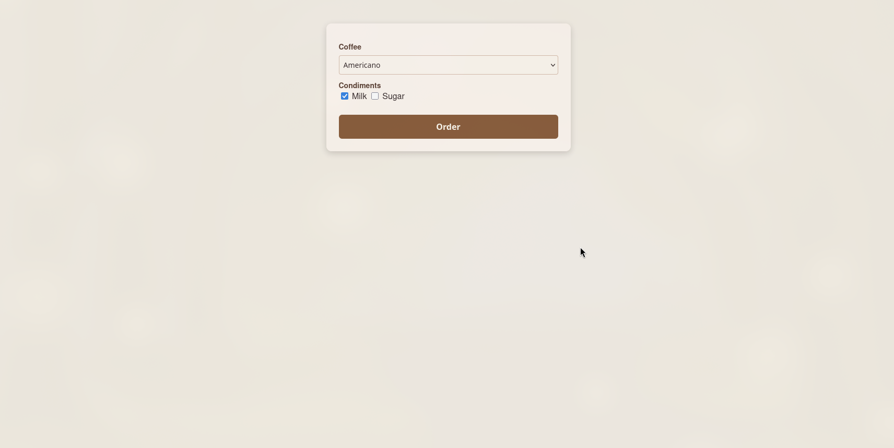
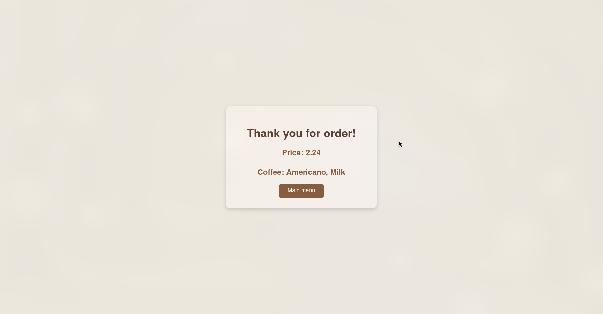

# CoffeePoint ver 1.0.1 ☕

A robust coffee shop management system built with **Spring Boot**.
This university project focuses on implementing several design patterns and demonstrating their practical use in a real-world style application.

---

## Tech Stack

* **Language:** Java 25 (Latest Features)
* **Framework:** Spring Boot 3.x
* **Build Tool:** Maven
* **Database:** MariaDB
* **Architecture:** N-layer Architecture

---

## Key Features

* Spring auth
* Decorator and Factory Method for coffee creation
* Abstract factory for snack creation
* Builder for response building
* Prototype for 'combo' products
* Singleton for menu

---

## In the future

* Strategy for AI behaviour 
* * Base behavior cheating, second to take order from client
* Command for Coffee and Snack undo order
* Observer for cheating with barista
* ...

## Base showcase













## ⚙Installation & Setup

### Prerequisites
* **JDK 25** or higher
* **Maven 3.9+**
* A running instance of your preferred SQL database

### Getting Started
1. **Clone the repository:**
   ```bash
   git clone [https://github.com/BagrinDan/CoffeePoint.git](https://github.com/BagrinDan/CoffeePoint.git)